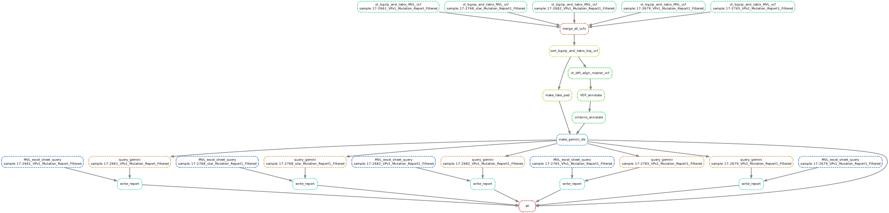

# MGOG Report Writer
Takes as input two files:

1. MVL vcf (one per sample)
2. MVL excel report (one per sample)

Place these in biowulf2.nih.gov:/data/OGVFB/MVL_processing/vcf and /data/OGVFB/MVL_processing/excel_report, respectively.

Then edit config.yaml to updated the date of `gemini_db_name` to today's date or however you are naming the Gemini databases.

Then run the Snakefile workflow as follows on biowulf2 in /data/OGVFB/MVL_processing/: 
`sbatch --partition=quick --job-name MVL_snake ~/git/casey_to_gemini/Snakemake.wrapper.sh`

Reports will be automatically generated and written to /data/OGVFB/MVL_processing/MGOG_reports 

The Gemini database generated is stored in /data/OGVFB/MVL_processing/gemini_db

